# DOME Digital Wallet User Guide

## Introduction to the DOME Digital Wallet
The DOME Digital Wallet is an essential tool for managing your digital identity within the DOME Marketplace. It enables secure interactions by allowing users to store, manage, and utilize digital credentials effectively. This wallet supports various functionalities including signing in, credential management, and QR code scanning for credential verification or issuance. Access the wallet by visiting [DOME Digital Wallet](https://wallet.dome-marketplace-prd.org).

For a detailed walkthrough on setting up your account and the initial steps to access the DOME Marketplace, please refer to the official [Onboarding Guide](https://github.com/DOME-Marketplace/onboarding/tree/official-csp-participants-onboarding). This guide will help you understand the prerequisites and steps to get started with DOME.

## 1. Registering on the DOME Digital Wallet
- **Access the Digital Wallet**:
    - Navigate to the [DOME Digital Wallet](https://wallet.dome-marketplace-prd.org) homepage and click on the "Register" button to begin the registration process.
      
      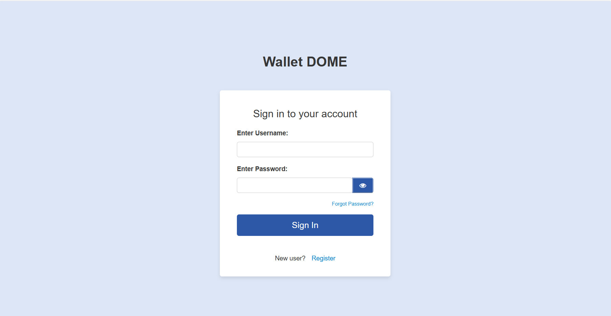

- **Complete the Registration Form**:
    - Fill out the form with the requested data.
      
      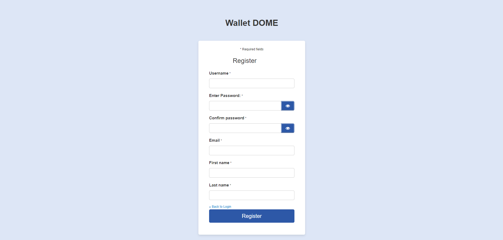

- **Email Validation**:
    - Check your email for a verification link. Click on this link to validate your email address.
      
      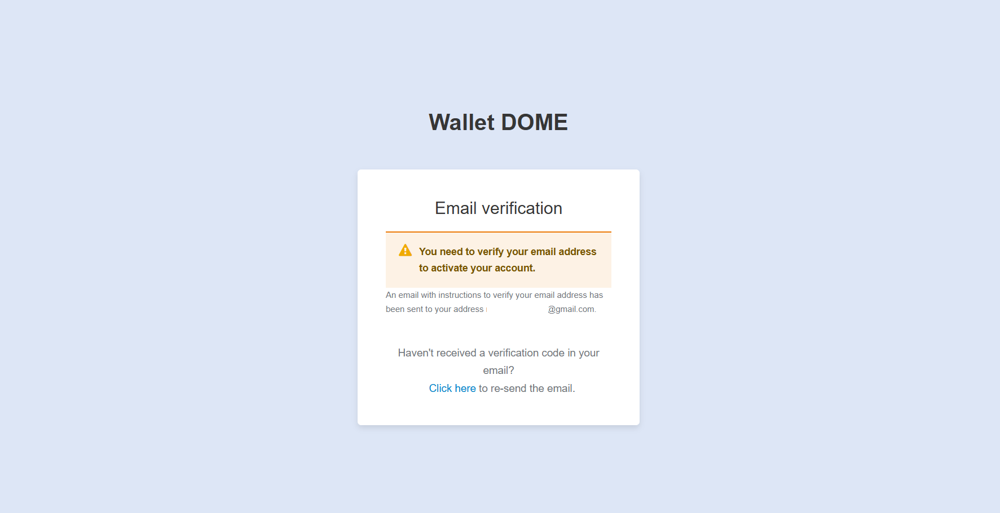

- **Passkey Registration**:
    - Set up a secure passkey that will be used to access your wallet.
      
      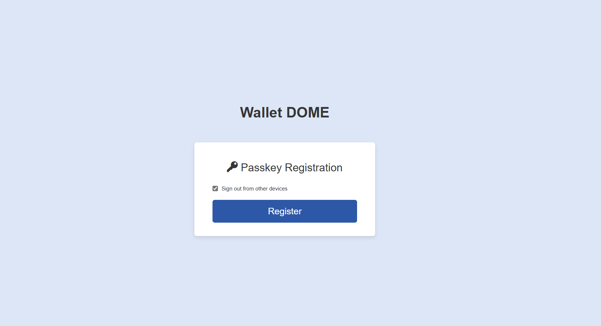
  
- **Successful Registration**:
    - Once you complete those steps you will get log into the wallet with your account
      
       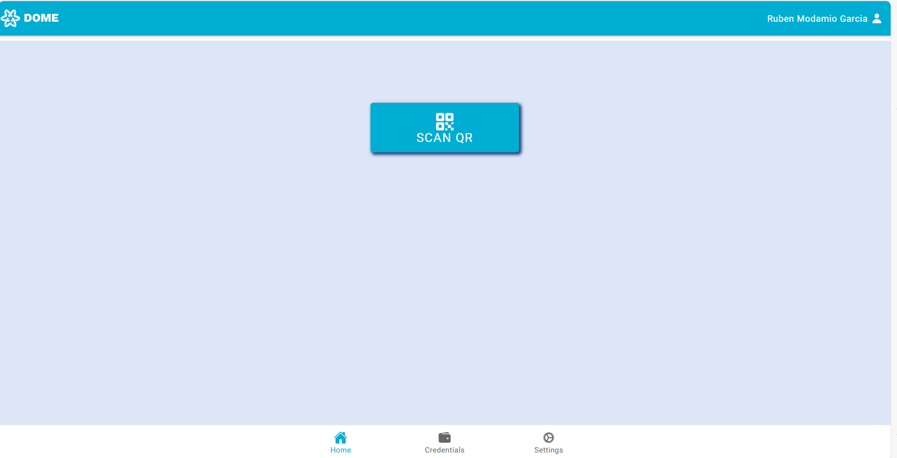

## 2. Forgot Password Process
- **Access the Forgot Password Link**:
    - On the login page, click the 'Forgot password' link if you cannot remember your password.

      

- **Submit Your Email Address**:
    - Enter your registered email address where prompted to receive a password reset link.

      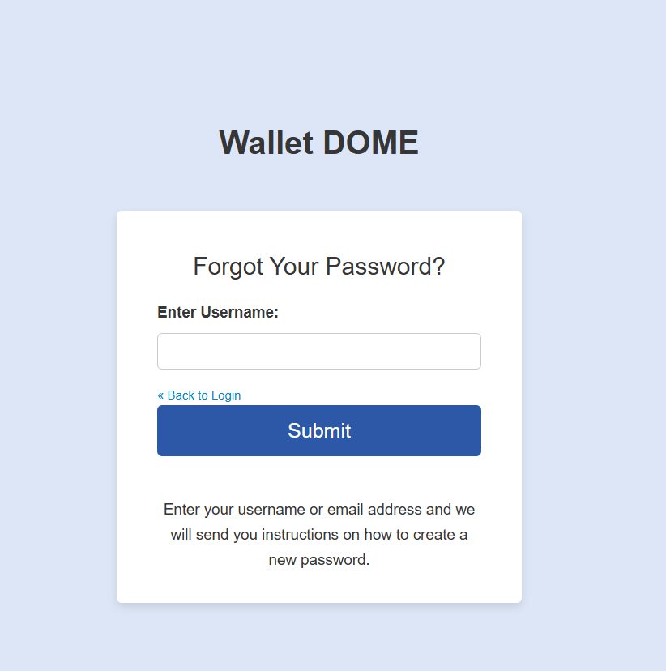

- **Confirmation Message**:
    - After submitting your email, you will see a message confirming that an email has been sent to you with the reset link.

      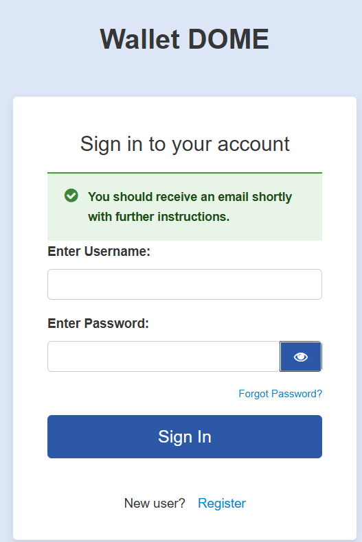

- **Check Your Email**:
    - Open your email to find the password reset message. Click the link provided within the email to proceed with resetting your password.

      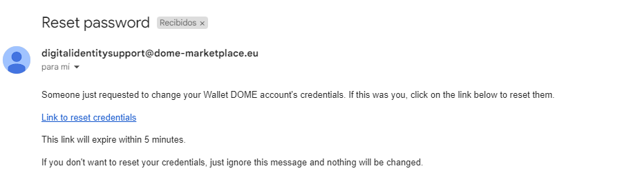

- **Reset Your Password**:
    - Follow the link from your email to a secure page where you can enter a new password.

      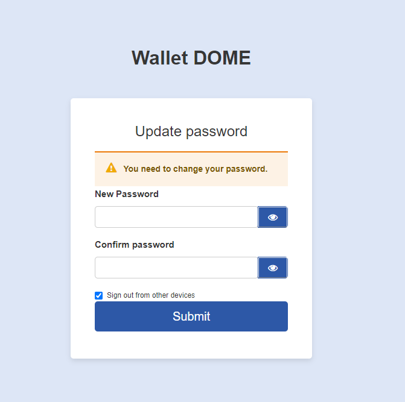

- **Confirmation of Password Reset**:
    - Once you have successfully reset your password, you will receive a confirmation on the screen indicating that your password has been changed.

      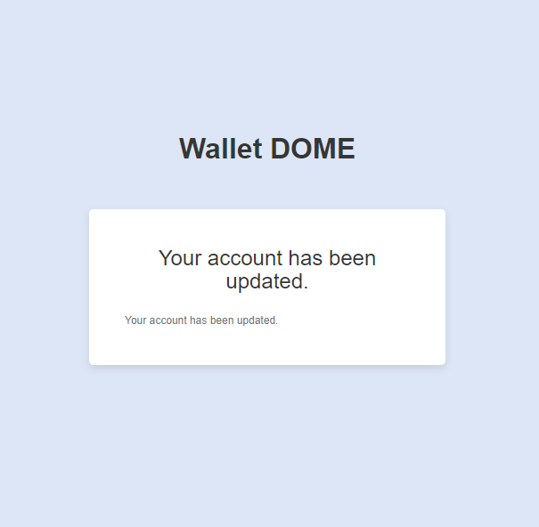

## 3. Main Functionalities of the Wallet

### QR Scan Functionality
- **General Use**:
    - The QR Scan function is used to scan QR codes provided by a third party, which can trigger processes for **obtaining** or **presenting** credentials. To initiate a scan, press the 'Scan QR' button to deploy the camera.

      

- **Scanning Process**:
    - After pressing the 'Scan QR' button, align the QR code within the camera to scan it. This will trigger the specific process linked to the QR code.

### Credential Issuance Process
- **PIN Verification**:
    - If the credential issuance process includes PIN verification (used for additional security), you will be prompted to enter a PIN **after scanning the QR code**, that you have received through a communication channel specified by the issuer. 

      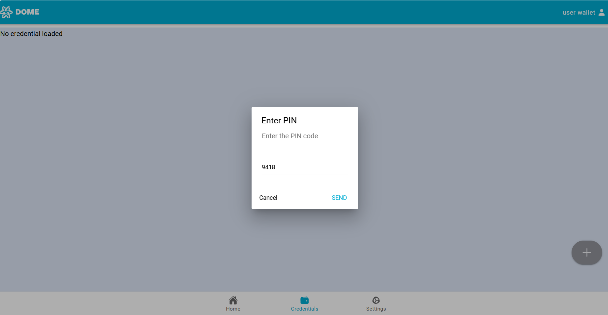

### Manual Intervention for Credential Signing
- **Signing Process**:
    - For credentials that require manual signing, you will initially receive them in an 'unsigned' state. If you attempt to obtain the signed credential before it is ready, a notification will appear stating that the credential is not ready for signing yet.

      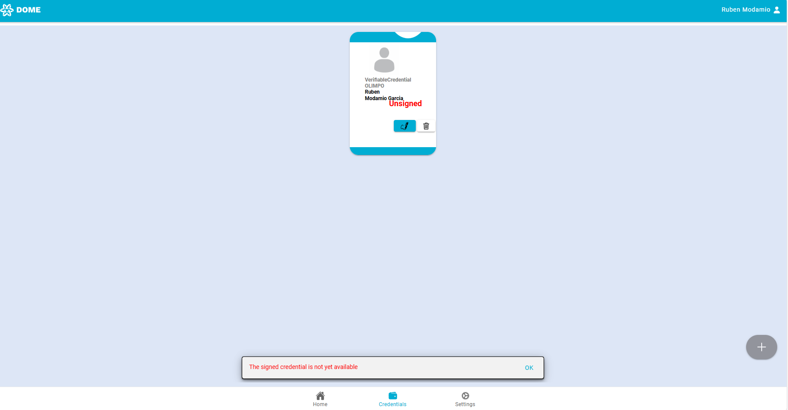
    - Once notified that your signed credential is ready, use the 'Sign' button in the wallet to finalize the credential.

      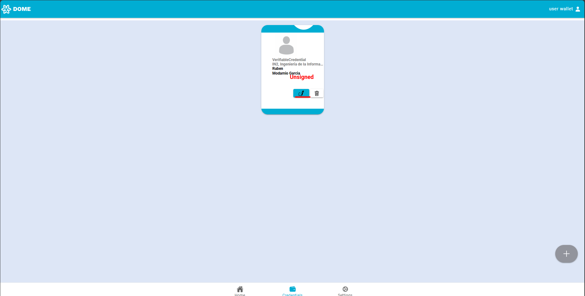

### Credential Presentation Process
- **Automatic Credential Display for Specific Types**:
    - When required to present a credential, the wallet automatically displays all available credentials of the type required for the transaction or verification. Select the appropriate credential you wish to present and confirm the action. If the presentation is successful, a confirmation pop-up will appear, indicating a successful transaction or verification.

      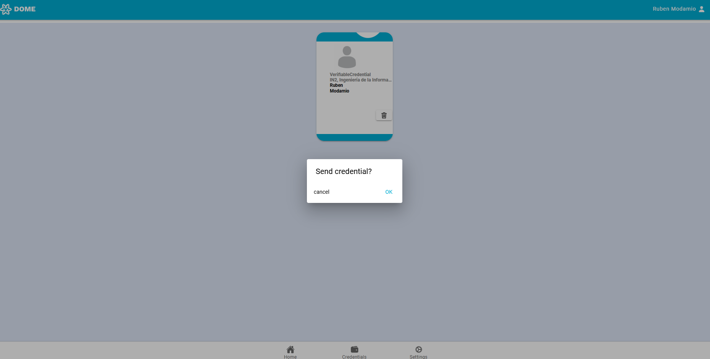

### Credential Deletion
- **Deleting a Credential**:
    - If you choose to delete a credential, simply press the trash icon on the credential. Be aware that once a credential is deleted, it cannot be recovered, so you must obtain a new one through the issuance process if needed.

      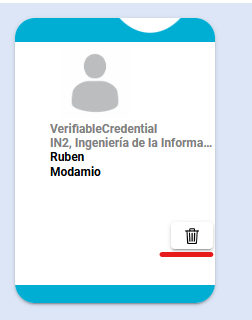

### Language Settings
- **Changing Language**:
    - You can change the language of the wallet interface by going to the settings and selecting your preferred language. Currently, the wallet supports English, Spanish, and Catalan.

      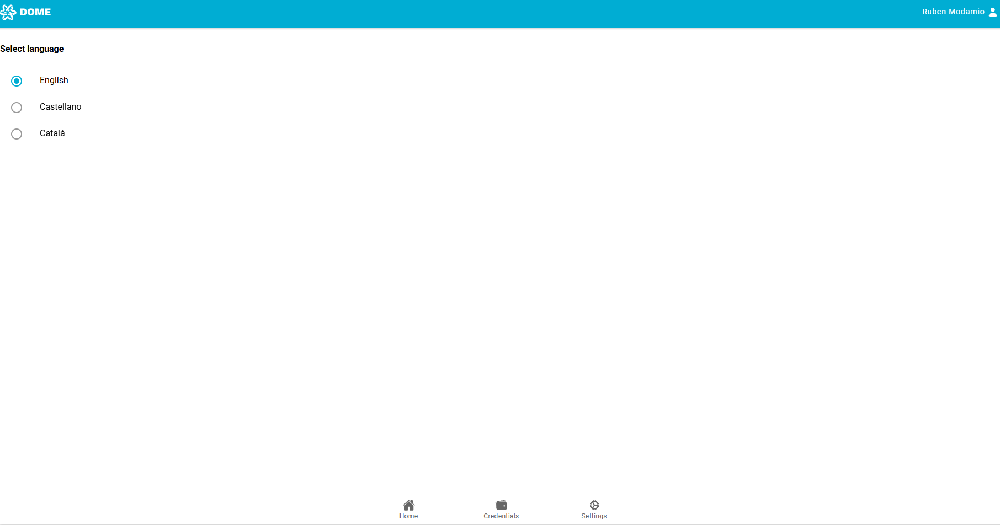

## 5. Troubleshooting Common Issues

### Camera Not Activating for QR Scan

If the camera does not activate when you attempt to use the **Scan QR** function, follow these troubleshooting steps to resolve the issue:

#### Navigate to Settings
- Within the DOME Wallet app, navigate to the **Settings** section.
  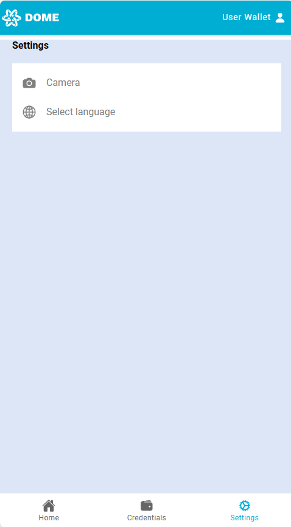

#### Access Camera Settings
- Find and select the **Camera** option to configure your camera settings.
  

#### Select Your Camera
- Choose your preferred camera for QR scanning. If you have more than one camera, you may need to select which one to use.

#### Ensure Camera Permissions are Enabled
- Make sure the DOME Wallet app has the necessary permissions to access the camera in your device's settings.
    - On Android: Go to Settings > Apps > Your Browser Permissions and ensure the Camera permission is enabled.
    - On iOS: Go to Settings > Privacy > Camera, find Your Browser and ensure the toggle is enabled.

#### Retry QR Scan
- Return to the home screen and try to scan the QR code again.

#### Reset Camera Permissions (Optional)
- If the issue persists, you can try resetting your camera permissions:
    - Go to your device's App Permissions settings.
    - Find the DOME Wallet app and remove the camera permissions.
    - Reopen the app and grant camera permissions again when prompted.

#### Restart Your Device
- If the problem continues, try restarting your device. This can refresh system processes that may be preventing the camera from functioning correctly.

#### Update Your Browser
- Ensure that you are using the latest version of your browser. Check your app store for any available updates, as newer versions may include fixes for known issues.

#### Check for System Updates
- If your device's operating system is outdated, it may cause compatibility issues. Check for any available system updates in your phone's settings and install them if necessary.

#### Contact Support
- If none of these steps resolve the issue, you may need to open a ticket for further assistance (https://ticketing.dome-marketplace-prd.org).

By following these steps, you should be able to resolve any issues with the camera not activating for QR code scanning.

